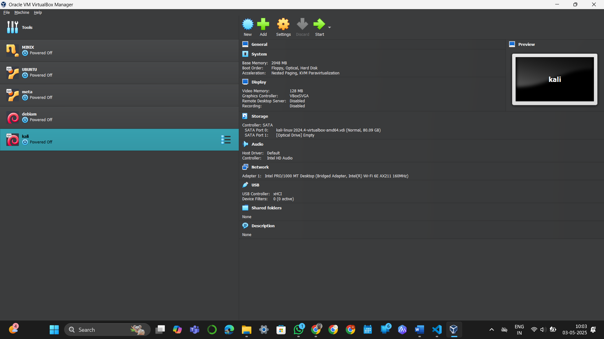
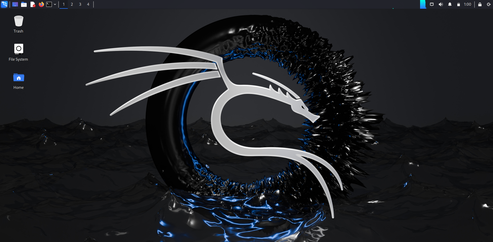
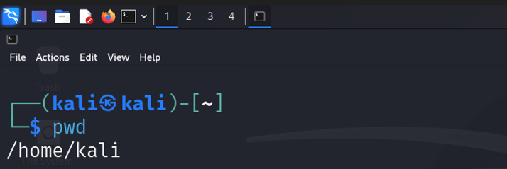
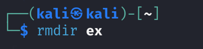
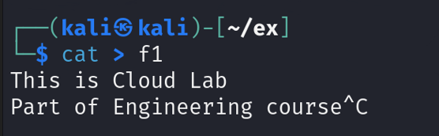

# Ex.3(A-C) Virtualization: Installation and Configuration of Oracle VirtualBox & Kali Linux, and Execution of Linux Commands

## Aim:
To set up a virtualized environment using Oracle VirtualBox, install Kali Linux as a guest OS, and execute fundamental Linux commands.

## 3.a) Installation and Configuration of Oracle VirtualBox

## Aim:
To install and configure Oracle VM VirtualBox.

## Pre-requisites:

* Machine with Internet access
* Minimum 4 GB RAM
* Sufficient storage space

## Steps:
1. Download Oracle VM VirtualBox:

    * Visit Oracle VirtualBox Official Site
    * Download installer for your OS (Windows/macOS/Linux).
2. Install Oracle VM VirtualBox (Example: Windows):

    * Launch Installer → Allow Changes → Click Next.
    * Choose Installation Options → Click Next.
    * Accept Network Interface Warning → Click Yes.
    * Click Install.
    * Finish Installation and Launch VirtualBox.
3. Configure VirtualBox:

    * Open VirtualBox.
    * Click New → Name VM → Select Type (Linux/Windows) and Version.
    * Allocate:
        * Minimum 2 GB RAM
        * Create Virtual Hard Disk (20 GB recommended).
    * Start Virtual Machine and provide ISO to install OS.

## Result:
Thus, Oracle VM VirtualBox was installed successfully.

## 3.b) Installation and Configuration of Kali Linux

## Aim:
To install and configure Kali Linux in Oracle VirtualBox.

## Pre-requisites:
* Oracle VM VirtualBox Installed
* 4 GB RAM and 20 GB Storage Minimum
* Kali Linux ISO image

## Steps:
1. Download Kali Linux ISO:

    * Visit Kali Linux Official Site
    * Download 64-bit ISO (Installer version).
2. Create a New Virtual Machine:

    * Open VirtualBox → Click New.
    * Name: "Kali Linux" → Type: Linux → Version: Debian (64-bit).
3. Allocate Memory:

    * Minimum 2 GB RAM (recommended 4 GB).
4. Create Virtual Hard Disk:

    * Select VDI (VirtualBox Disk Image).
    * Choose Dynamically allocated.
    * Set Disk size to 20 GB or more.
5. Configure ISO Image:

    * Settings → Storage → Controller: IDE → Empty CD → Choose Disk File → Select Kali Linux ISO.
6. Start Installation:

    * Boot Virtual Machine → Choose Graphical Install.
    * Set Language, Region, Keyboard.
    * Configure Network → Set Hostname (e.g., kali).
    * Set root password.
    * Disk Partitioning: Use entire disk → All files in one partition.
    * Install System → Install GRUB Bootloader → Finish Installation.
7. Login to Kali Linux:

    * Use root credentials.
8. (Optional) Install Guest Additions:

    * Devices → Insert Guest Additions CD Image → Follow steps inside Kali.

## Snapshots:
AWS Account Creation Snapshot

Snapshot 1: Installing Oracle VirtualBox


Snapshot 3: Kali Running in VirtualBox



## Result:
Thus, Kali Linux guest OS was installed and configured successfully.

## 3.c) Execution of Linux Commands in Kali

## About Linux:
* Open-source operating system.
* Kernel manages communication between hardware and software.
* Commands are case-sensitive.

## Linux Commands:
1. ls Command
    
    The ls command is used to display a list of content of a directory.

### Syntax:
```
ls
```


2. pwd Command

    The pwd command is used to display the location of the current working directory.

### Syntax: 
```
pwd
```


3. mkdir Command

    The mkdir command is used to create a new directory under any directory.

### Syntax: 
```
mkdir <directory_name>
```


4. rmdir Command

    The rmdir command is used to delete a directory.

### Syntax: 
```
rmdir <directory_name>
```


5. cd Command
The cd command is used to change the current directory

### Syntax: 
```
cd <directory_name>
```


6. cat Command

    The cat command is a multi-purpose utility in the Linux system. It can be used to create a file, display content ofthe file, copy the content of one file to another file, and more.

### Syntax: 
```
cat [options] [file_name]
```



7. cp Command

    The cp command is used to copy a file or directory.
### Syntax: 
```
cp [source] [destination]
```


8. mv Command

    The mv command is used to move a file or a directory form one location to another location.

### Syntax: 
```
mv [source] [destination]
```


9. touch Command

    Create empty file.

### Syntax: 
```
touch [filename]
```


10. vi Command

    Edit file contents using editor.

### Syntax: 
```
vi [filename]
```


## Result:
Thus, various Linux commands were executed successfully in Kali Linux virtual machine.


